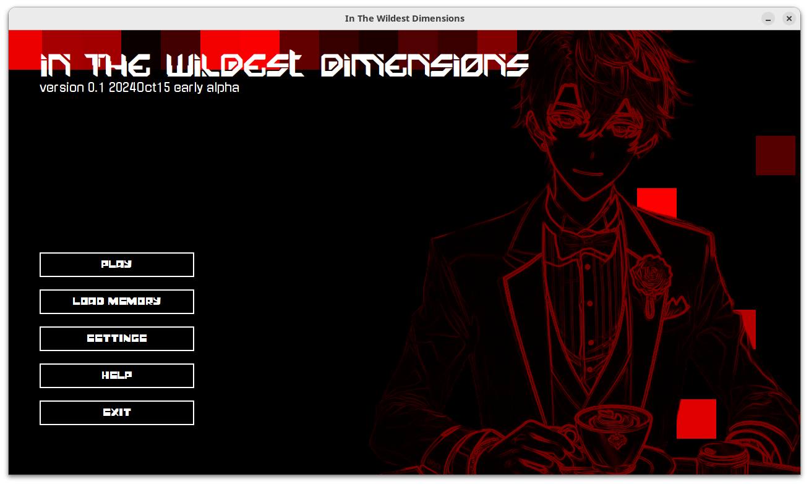

It's supposed to be a 'wild' visual novel, indeed! But currently paused due to my time being reserved for other projects, great and small.

As of now, it contains:
- [x] background music
- [x] UI interaction sounds
- [x] cinematic intro title sequence
- [x] custom TTF font usage
- [x] custom cursor
- [x] tweening animations, e.g. animated background
- [ ] gameplay content (haha, you gotta wait for a while)
